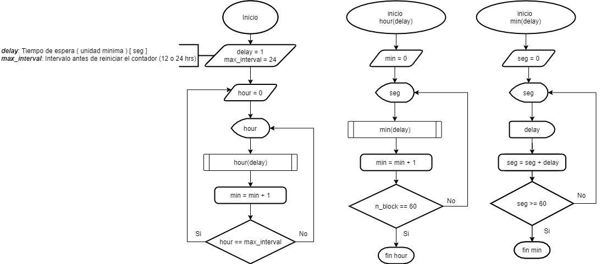
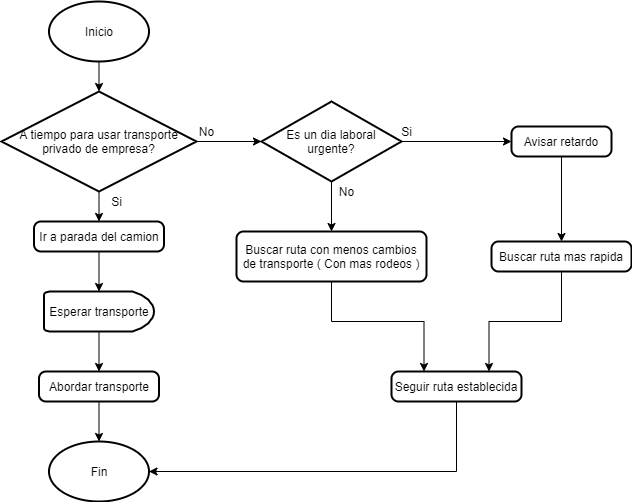

# challenge-prework-01

Recap: Curso de Pensamiento Logico.

## Retos

1. Crea un diagrama de flujo que represente "Como funciona un reloj".

2. Crea un diagrama de flujo que represente "Ir de casa al trabajo A => B".

## Licencia

challenge-prework-01 se lanza bajo la licencia [MIT](https://opensource.org/licenses/MIT).
